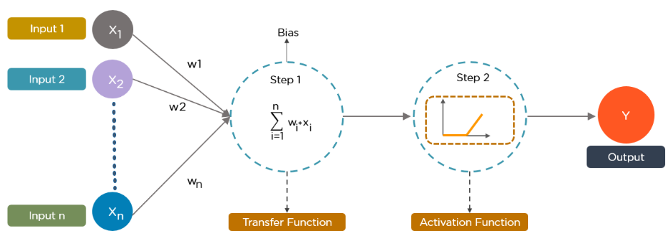

# 🧠 Deep Learning

Welcome to the **Deep Learning** lecture series!  
This repository provides structured lecture notes, intuitive explanations, and practical coding projects to help you learn and apply deep learning concepts effectively.

We start with foundational topics like **Perceptrons**, **Activation Functions**, **Loss Functions**, and **Gradient Descent**, then move toward core deep learning models such as:

- **ANN** (Artificial Neural Networks)  
- **CNN** (Convolutional Neural Networks)  
- **RNN** (Recurrent Neural Networks)  
- **GAN** (Generative Adversarial Networks)  
- **Autoencoders**  
- **Object Detection**  
- **Image Segmentation**

Each concept is paired with real-world Python implementations using popular deep learning libraries.

## Neural Networks

Start small, stay consistent, and remember — every great AI begins with a simple neuron and the curiosity to learn. 🌟🧠

---

## 📚 Table of Contents

1. [Lecture 1: Perceptron](#lecture-1-perceptron)
2. [Lecture 2: Hinge Loss](#lecture-2-hinge-loss)
3. [Lecture 3: Multilayer Perceptron](#lecture-3-multilayer-perceptron)
4. [Lecture 4: Projects](#lecture-4-projects)  
   - [4.1 Credit Card Customer Churn Using ANN](#41-credit-card-customer-churn-using-ann)  
   - [4.2 Handwritten Digit Classification Using ANN](#42-handwritten-digit-classification-using-ann)  
   - [4.3 Graduate Admission Prediction Using ANN (Regression)](#43-graduate-admission-prediction-using-ann-regression)  
5. [Lecture 5: Loss Functions](#lecture-5-loss-functions)
6. [Lecture 6: Gradient Descent](#lecture-6-gradient-descent)

---

## Lecture 1: Perceptron

In deep learning, a perceptron is a fundamental building block, essentially a single-layer neural network, that serves as a basic unit of computation. It's designed for supervised learning and binary classification tasks, meaning it can categorize data into one of two classes. 

### Formula:
The perceptron function is defined as:

**y = f(w · x + b)**

Where:  
- **w** = weights  
- **x** = input features  
- **b** = bias  
- **f** = activation function (typically a step function)

**Important Concepts:**
- Linearly separable problems
- Perceptron convergence theorem
- Learning rate and weight updates

---

## Lecture 2: Hinge Loss

Hinge loss is a loss function primarily used for training classifiers, especially Support Vector Machines (SVMs). It aims to maximize the margin between different classes, effectively pushing the decision boundary away from data points. Hinge loss is particularly useful in binary classification problems, where it penalizes misclassifications and encourages a clear separation between classes. 

### Formula:
$$
\text{Hinge Loss} = \sum_{i=1}^{n} \max(0, 1 - y_i \cdot \hat{y}_i)
$$

Where:  
- **yᵢ ∈ {−1, +1}** → the true label  
- **ŷᵢ** → the predicted output

Used to penalize misclassifications and encourage a larger margin.

---

## Lecture 3: Multilayer Perceptron (MLP)

A Multilayer Perceptron (MLP) is a type of feedforward artificial neural network characterized by multiple layers of interconnected nodes (neurons). It's a fundamental building block in deep learning, capable of learning complex patterns and relationships in data. MLPs consist of an input layer, one or more hidden layers, and an output layer, with each layer fully connected to the next. 

**Architecture:**
- Input Layer
- One or more Hidden Layers
- Output Layer

### Key Features:
- Universal function approximation
- Uses backpropagation for training
- Common activations: ReLU, Sigmoid, Softmax

---

## Lecture 4: Projects

### 4.1 [Credit Card Customer Churn Using ANN](https://github.com/anwarzahid8284/Credi-Card-Customer-Prediction-Using-ANN)

**Problem**: Predict whether a customer will churn based on demographics and account usage.

- Dataset: Customer demographics and account info
- Model: ANN with multiple dense layers
- Result: Accuracy, confusion matrix, classification report

---

### 4.2 [Handwritten Digit Classification Using ANN](https://github.com/anwarzahid8284/MNIST-Handwritten-Digit-Classification-ANN)

**Problem**: Classify handwritten digits from the MNIST dataset.

- Dataset: MNIST (28x28 grayscale images)
- Model: ANN with flatten, dense, and dropout layers
- Evaluation: Accuracy, loss graph, sample predictions

---

### 4.3 [Graduate Admission Prediction Using ANN (Regression)](https://github.com/anwarzahid8284/Graduate-Admission-Prediction-Using-ANN)

**Problem**: Predict student admission chances based on GRE, TOEFL, and CGPA.

- Task: Regression
- Model: ANN using ReLU activations with MSE loss
- Metrics: RMSE, R² Score

---

## Lecture 5: Loss Functions

A loss function quantifies the difference between a model's predicted output and the actual target value, providing a measure of how well the model is performing. This value, often a single number, guides the model's learning process by indicating the error it needs to minimize during training. Essentially, loss functions act as a feedback mechanism, telling the model how far off its predictions are and directing it to adjust its parameters (weights and biases) to improve accuracy. 

### Common Loss Functions:

#### 🔹 Mean Squared Error (MSE) - for Regression
$$
\text{MSE} = \frac{1}{n} \sum_{i=1}^{n} (y_i - \hat{y}_i)^2
$$

#### 🔹 Binary Cross-Entropy - for Binary Classification
$$
\text{BCE} = -\frac{1}{n} \sum_{i=1}^{n} [y_i \log(\hat{y}_i) + (1 - y_i) \log(1 - \hat{y}_i)]
$$

#### 🔹 Categorical Cross-Entropy - for Multi-class Classification
$$
\text{CCE} = -\sum_{i=1}^{n} y_i \log(\hat{y}_i)
$$

---

## Lecture 6: Gradient Descent

Gradient descent is an optimization algorithm used in deep learning to minimize a model's cost function. It works by iteratively adjusting the model's parameters (like weights and biases) in the direction of the steepest descent of the cost function, effectively finding the set of parameters that produce the lowest error.

### Learning Rate  η: 
Learning rate is a hyperparameter that determines the step size at each iteration when updating a model's parameters during training. It controls how quickly or slowly the model learns from the training data. A high learning rate can lead to faster convergence but may cause overshooting or instability, while a low learning rate can result in slow convergence and potentially getting stuck in local minima.

### Loss Function (Linear Regression):
$$
Loss(m, b) = \frac{1}{n} \sum_{i=1}^{n} (y_i - (mx_i + b))^2
$$

### Weight Update:
$$
w_{\text{new}} = w_{\text{old}} - \alpha \cdot \frac{\partial \text{Loss}}{\partial w}
$$

### Bias Update:  
$$
b_{\text{new}} = b_{\text{old}} - \alpha \times \text{slope}
$$

### Slope:
$$
\text{slope} = -2 \sum_{i=1}^{n}(y_i - mx_i - b)^2
$$

---

## 🚀 Final Note

This repository is a journey into the world of Deep Learning. Whether you're just getting started or revisiting the basics, these lectures and projects aim to build a solid foundation in neural networks.

> **"Every great AI model starts with a neuron and a dream."**

Stay curious, keep experimenting, and let’s make Deep Learning World! 💻🧠🔥

---

## 🤝 Connect with Me

---

